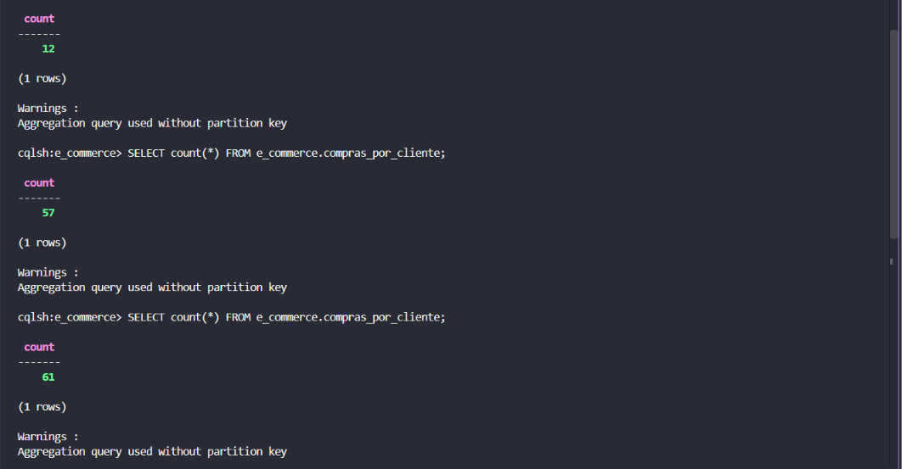

<!-- BADGES DE TECNOLOGIAS -->
<p align="left">
  
  
  
  
  
  
</p>

# 🛒 E-Commerce Real-Time Streaming & Persistência em Banco NoSQL (Apache Cassandra)

## 📌 Contexto & Evolução do Projeto
Este repositório é a **segunda etapa e continuação direta** do projeto de mensageria em tempo real publicado em:
🔗 **[e-commerce-kafka-pyspark-streaming](https://github.com/VitorRodrig15/e-commerce-kafka-pyspark-streaming)**

Na fase anterior, a arquitetura realizava a ingestão de eventos via **Apache Kafka** e o processamento em streaming com **PySpark Structured Streaming**, exibindo os resultados consolidados diretamente no terminal (`console output`).

Nesta nova versão, substituímos a saída em memória por **persistência estruturada distribuída**, integrando o pipeline ao **Apache Cassandra** — um banco de dados NoSQL de altíssimo desempenho, ideal para séries temporais e dados transacionais de alta escala.

---

## 🏗️ Arquitetura Integrada

[Producer Python / Faker] ➔ [Kafka Broker] ➔ [PySpark Streaming Engine] ➔ [Apache Cassandra (NoSQL)]

---

## 🚀 Passo a Passo de Instalação e Conexão com o Cassandra

### 1. Inicialização do Cluster Cassandra via Docker
Para subir o banco NoSQL sem necessidade de instalação nativa:

```bash
docker run --name meu-cassandra -d -p 9042:9042 cassandra:latest
```

Verifique se o nó está ativo (UN - Up/Normal):

```bash
docker exec -it meu-cassandra nodetool status
```

2. Modelagem Orientada a Consultas (CQL)
Acesse o terminal interativo cqlsh:

```bash
docker exec -it meu-cassandra cqlsh
```

Execute a criação do Keyspace e da Tabela otimizada para consultas por cliente ordenadas por data:

```bash
-- Criar Keyspace
CREATE KEYSPACE IF NOT EXISTS e_commerce
WITH replication = {
    'class': 'SimpleStrategy',
    'replication_factor': 1
};
```
Selecionando o Keyspace criado:

```bash
USE e_commerce;
```

Criar Tabela (Partition Key + Clustering Columns):
```bash
CREATE TABLE IF NOT EXISTS compras_por_cliente (
    cliente_id uuid,
    data_compra timestamp,
    compra_id uuid,
    valor_total decimal,
    status text,
    produtos list<text>,
    PRIMARY KEY ((cliente_id), data_compra, compra_id)
) WITH CLUSTERING ORDER BY (data_compra DESC, compra_id ASC);
```

⚡ Alteração e Adaptação do consumer_pyspark.py
Para conectar a engine de streaming do PySpark ao Cassandra, realizamos três grandes modificações no script do consumidor utilizado no repositório anterior:

1. Adição do Conector Datastax na Sessão do Spark
Inclusão do pacote spark-cassandra-connector e parâmetros de host:

```bash
def criar_sessao_spark():
    return SparkSession.builder \
        .appName("EcommerceSalesStreamingProcessor") \
        .config("spark.jars.packages", 
                "org.apache.spark:spark-sql-kafka-0-10_2.12:3.5.1,"
                "com.datastax.spark:spark-cassandra-connector_2.12:3.5.0") \
        .config("spark.cassandra.connection.host", "127.0.0.1") \
        .config("spark.cassandra.connection.port", "9042") \
        .getOrCreate()
```

2. Mapeamento dos Dados para o Schema do Cassandra
Transformação dos tipos de dados do evento JSON recebido pelo Kafka para os tipos nativos da tabela Cassandra (UUID, Timestamp, Decimal e List):
```bash
df_cassandra = df_kafka.selectExpr("CAST(value AS STRING) as json_payload") \
    .select(from_json(col("json_payload"), schema_venda).alias("data")) \
    .select(
        expr("uuid()").alias("cliente_id"),
        to_timestamp(col("data.data_hora_venda"), "dd/MM/yyyy HH:mm:ss").alias("data_compra"),
        expr("uuid()").alias("compra_id"),
        col("data.valor_total_venda").cast("decimal(10,2)").alias("valor_total"),
        expr("'PAGO'").alias("status"),
        expr("transform(data.produtos_comprados, x -> x.nome_produto)").alias("produtos")
    )
```

3. Persistência Contínua via foreachBatch
Substituição do .format("console") pelo método de salvamento em lote por lote (append) diretamente na tabela do Keyspace:
```bash
def gravar_no_cassandra(target_df, batch_id):
    target_df.write \
        .format("org.apache.spark.sql.cassandra") \
        .option("keyspace", "e_commerce") \
        .option("table", "compras_por_cliente") \
        .mode("append") \
        .save()

query = df_cassandra.writeStream \
    .foreachBatch(gravar_no_cassandra) \
    .option("checkpointLocation", "./checkpoints/kafka_to_cassandra") \
    .start()
```
Porém para facilitar deixei as alterações salvas neste repositório, das alterações no consumer_pyspark.py, para a conexão no banco de dados NoSQL do Apache Cassandra.

---

🧪 Validação da Ingestão em Tempo Real

Inicie o consumidor PySpark:
```bash
python consumer_pyspark.py
```

Execute o gerador de vendas (Producer):
```bash
python
 producer.py
```

Consulte as vendas persistidas no Cassandra pelo cqlsh:
```bash
SELECT count(*) FROM e_commerce.compras_por_cliente;
SELECT * FROM e_commerce.compras_por_cliente LIMIT 10;
```


<br>
*Mostrando o processo de Consulta no Terminal*

<ElicitationsGroup message="Precisa de mais alguma documentação ou suporte para a publicação do repositório?">
  <Elicitation label="Como estruturar o commit e push das alterações no Git" query="Quais comandos Git devo usar para publicar essas atualizações no meu repositório?"/>
  <Elicitation label="Criar resumo de encerramento do projeto para relatório ABNT" query="Escreva um texto de conclusão técnica para o relatório final ABNT sobre a integração do PySpark com Cassandra."/>
</ElicitationsGroup>
